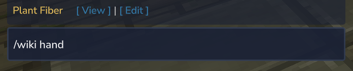
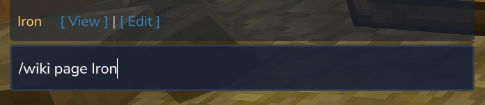
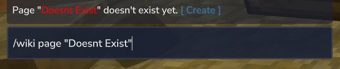
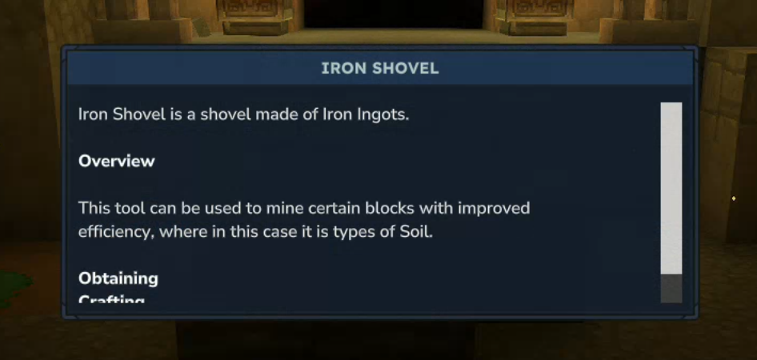

# Hytale Wiki plugin

Allows the player to search the wiki in-game. Provides links to best results or previews the wiki page in-game.

Drawbacks:

- Not possible to avoid the "untrusted link" prompt
- Not possible to open a link directly without clicking in chat, as it happens client-side

## Commands

| Command                                   | Description                                                                                                        |
|-------------------------------------------|--------------------------------------------------------------------------------------------------------------------|
| `/wiki`                                   | provides a base link to the wiki                                                                                   |
| `/wiki hand [--ui]`                       | open page for item in hand                                                                                         |
| `/wiki <search term> [--ui]`              | search the wiki for the most relevant entries, looks for exact matches; if exact match and `--ui`, open in-game UI |
| `/wiki page <page key/page title> [--ui]` | open the page directly with no search                                                                              |

## Showcase

## UI

Adding `--ui` to commands will try to open an in-game UI with the wiki page content. It currently doesn't work on most
pages.

It is highly imperfect and only
contains basic text elements from the pages. UI is created by parsing the
page [wikitext](https://www.mediawiki.org/wiki/Wikitext) source. Things like template expansion are not possible, hence
information that uses templates will be missing in-game.

[wikitext-parser](https://github.com/lucaskjaero/wikitext-parser) is used to construct
an [AST](https://en.wikipedia.org/wiki/Abstract_syntax_tree) that is then walked to construct the resulting UI elements.

The parser cannot handle:

- pipes (`|`) outside of wiki or category links
- characters like the non-breakable space, essentially anything below 32 except newline causes a mismatched input
- underscores in certain cases (inside XML tags)

These things are therefore stripped before parsing the page source.

### Other possible approaches

**Using constructed html/css/js to render in-game UI** \
Advanced html/css/js support in the game's current UI system would be a lot of hard, tedious work. It would offer the
benefit of having templates expanded.

**Full-page screenshot rendering** \
Instead of constructing in-game UI with text elements a single full-page screenshot could be used to view the page. This
would be visibly perfect. Haven't tried, not sure about limitations. 
